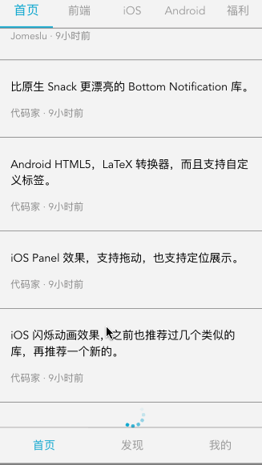

# gank
---

[](https://travis-ci.org/xandeer/gank)
[](https://www.versioneye.com/user/projects/58abe78eb4d2a20045c15823)

> 一个 `vue2` 实战项目，实现了一个 **gank.io** 资源的阅读应用。欢迎 star/fork。

## 用到的开源项目
***
1. [vue](https://github.com/vuejs/vue)
2. [vue-router](https://github.com/vuejs/vue-router)
3. [vuex](https://github.com/vuejs/vuex)
4. [mint-ui](https://github.com/ElemeFE/mint-ui)
5. [vue-resource](https://github.com/pagekit/vue-resource)
6. [vue-awesome-swiper](https://github.com/surmon-china/vue-awesome-swiper)
7. [vue-cli](https://github.com/vuejs/vue-cli)
8. [vuejs-templates/webpack](https://github.com/vuejs-templates/webpack)
9. [pug](https://github.com/pugjs/pug) *本项目中 vue 模板使用 pug 书写，另外提供了 HTML 版本，可切换到 html 分支查看。*

## 预览
***
[demo](http://xandeer.me/gank)（请用手机模式预览）

欢迎使用手机扫一扫打开：

[](http://xandeer.me/gank)

## 实现的功能
***
- 无限滚动
- 图片懒加载
- 左右滑动切换
- 应用内跳转保存跳转前的位置
- 夜间模式
- 切换主题色
- 等等

### 首页


### 滑动切换及位置保存



### 选择主题色及夜间模式

> 主题色页面的色盘颜色可在 [src/config/index.js](src/config/index.js) 中改变，主题色及夜间模式会保存在 localStorage 中，所以下次打开还是之前的主题


## 安装编译
***
### 注意

如果 `node-sass` 安装遇到问题，可参考 https://github.com/lmk123/blog/issues/28

``` bash
# install dependencies
npm install

# serve with hot reload at localhost:8080
npm run dev

# build for production with minification
npm run build

# build for production and view the bundle analyzer report
npm run build --report
```

## 目录结构
***
<pre>
├── assets             // Readme 图片资源
├── build              // 构建服务和webpack配置
├── config             // 不同环境的配置
├── dist               // build目录
├── index.html         // 入口文件
├── src                // 源码目录
│   ├── components     // 各种组件
│   ├── config         // 页面配置，如主题配置
│   ├── store          // vuex 状态管理
│   ├── router         // 路由配置
│   ├── utils          // 工具接口
│   ├── views          // 页面视图
│   ├── App.vue        // 主页面
│   └── main.js        // Webpack 预编译入口
</pre>

## 感谢
---
- [gank.io](http://gank.io/api) 提供的 api
- 开源项目贡献者
- 开源项目文档撰写者

## License

MIT License
